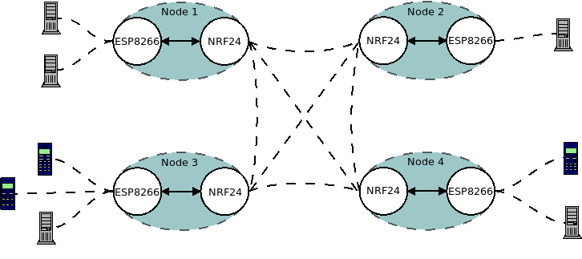
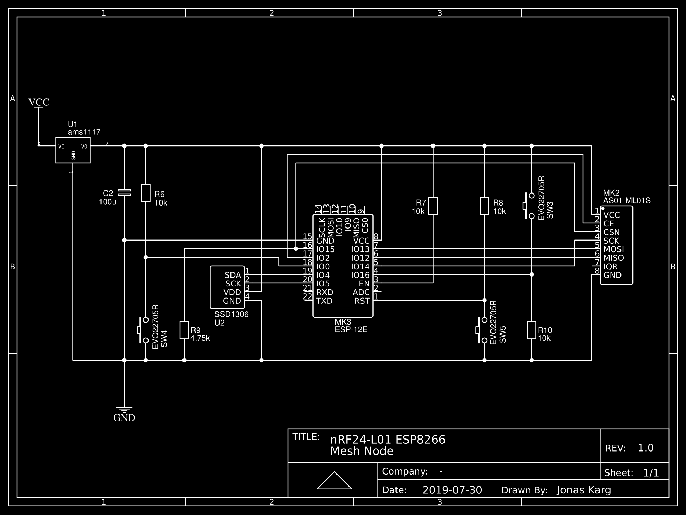
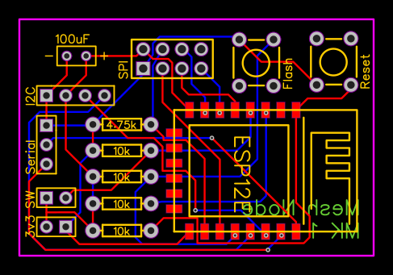

# nRF24-L01 + ESP8266 Mesh Network

## I am building a mesh network consisting of multiple nodes, each equipped with the following hardware:
- 1x Nrf24-L01 2.4GHz transceiver with antenna (+ base module, if necessary) [ 0.0009 - 15mA ]
- 1x ESP8266-12F WiFi module/microprocessor [ 0.01 - 170mA ]
- 1x 0.9" 128x32 OLED I2C Display [ 0 - 12mA ] (Will be disabled unless wake button is pressed)
- 1x Adjustable step down converter => ~4.5V to 3.3V [ Advertised efficiency: 97% expected efficiency: 90% ]
- 3x AA Battery + Holder => connected in series to reach ~4.5V [ 400 - 2400mAh (* ~0.9 because of efficiency of step down converter) ]
- 1x 2-Position power switch
- 1x momentary push button => Wake display / GUI input

Expected cost for 4pcs: ~30\$.<br>
Actual cost: 34\$. (All components were ordered from AliExpress.com)<br>

Pessimistic battery-runtime: (400mAh * 0.8)  / (15mA + 170mA + 12mA) = ~1.6h<br>
Optimistic battery-runtime:  (2400mAh * 0.9) / (4mA + 80mA + 0mA)    = ~25.7h<br>
Realistic battery-runtime:   (1.6h + 25.7h)  / 2                     = ~13.7h

## Configuration:
I expect a range of 400-700m between two of the Nrf24 chips and a range of ~8m for the ESP8266s. 

### Plan A:
The idea is to provide a (pretty slow) LAN network by connecting the Nrf24s with each other and using the ESPs, which would each be physically connected to a NRF, as access points for regular WiFi devices. I expect a data transfer speed of around 1-2mBit.

### Plan B:
Configure the network as a decentralized chat app with some cool features like file exchange and a node tree, all running on webservers on the ESPs and using either the nRFs or the ESPs (whichever has better connectivity) for data transfer.

https://tmrh20.github.io/RF24Network<br>



## Potential issues:
- Interference (ESP/NRF/power-supply) => Shielding / Input voltage smoothing?
- Batteries/PS - Amperage/Voltage
- Lower-than-expected transfer speeds (various reasons)
- How would I even send network traffic over the NRFs?
  - MAC/IP-addresses?

## Hardware setup (used for testing):
<b>(Breadboard setup with bare ESP8266-12E module + schematics below ↓)</b>
I am using two NodeMCU dev boards, each with their own nRF24-L01 chip, for testing.
The nRFs are connected to the ESPs via the hardware SPI interface.<br>

| NRF24-L01 | NodeMCU | ESP8266-12E |
| --------- | ------- | ----------- |
| GND       | GND     | GND         |
| VCC       | VCC     | VCC         |
| CE        | D4      | IO2         |
| SCK       | D5      | IO14        |
| MISO      | D6      | IO12        |
| MOSI      | D7      | IO13        |
| CSN       | D8      | IO15        |

<b>🚨 IMPORTANT: IO15 (D8 on the NodeMCU) must pulled low using a ~4.75k Ohm resistor to enable hardware serial. 🚨</b>

```cpp
// IO 2 and 15 are the "interesting" pins.
RF24 radio(2, 15);
```

## Other notes:
The ESP8266 has a Watch-Dog-Timer (WDT), which aims to prevent the board from freezing in e.g. a "endless" loop. To prevent the timer from expiring and thus resetting the ESP, you have to either disable it using `ESP.wdtDisable();`, adjust it for your purposes with `ESP.wdtEnable(MILLISECOND_AMOUNT);` or just calling `yield();` every once in a while (`yield()` is also called after every `loop()`);<br>
Watch out for blocking operations in the libraries you use (e.g. `NRF24.waitAvailable()`).<br>
A great tool for developing with the ESP8266 is **PlatformIO**.<br>

## References/Resources:
https://tmrh20.github.io/RF24
https://tmrh20.github.io/RF24Network<br>
https://tmrh20.github.io/RF24Mesh (Probably not going to use this lib - I want a flat network)

https://en.wikipedia.org/wiki/Serial_Peripheral_Interface<br>
https://techtutorialsx.com/2017/01/21/esp8266-watchdog-functions<br>
https://platformio.org<br>
https://docs.platformio.org/en/latest/boards/espressif8266/nodemcuv2.html?highlight=nodemcu<br>
https://easyeda.com<br>
"dia" - Diagram tool

## Prototype Schematics and PCB


### On a breadboard


## ToDo:
- Plan layout in case for min interference
- What stuff on display?
  - Connection
    - How many nodes
    - Packet loss
- Efficiency
  - Disable WDT
  - Disable ADC
  - Automatic Range/Packet size adjustment
